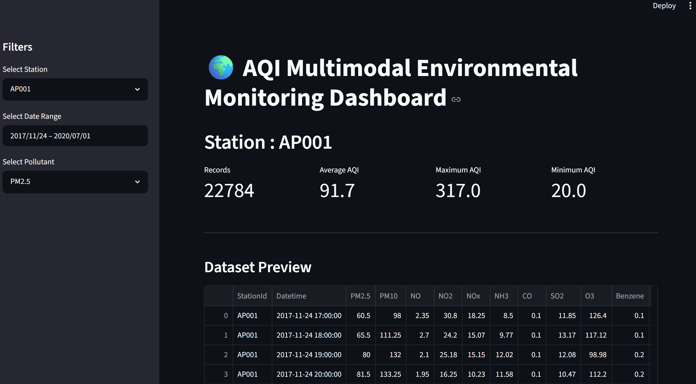

# 🌍 AQI Multimodal Environmental Monitoring Pipeline


An end-to-end **Machine Learning and Data Engineering pipeline** for **Air Quality Index (AQI) Monitoring, Validation, Prediction, and Visualization** using environmental sensor data.

This project demonstrates a complete workflow from raw CPCB air quality observations to intelligent AQI prediction through data validation, feature engineering, machine learning, uncertainty estimation, and an interactive Streamlit dashboard.

---

# 📌 Project Highlights

✅ Data Quality Validation

✅ Missing Value Imputation (KNN)

✅ Outlier Detection & Visualization

✅ Sensor Drift Detection

✅ Feature Engineering

✅ Multimodal Data Fusion

✅ Physics-Informed AQI Validation

✅ Random Forest AQI Prediction

✅ Multi-Model Performance Comparison

✅ Prediction Uncertainty Estimation

✅ Interactive Streamlit Dashboard

✅ Hybrid Search Interface

---

# 📂 Project Structure

```text
AQI_Multimodal_Pipeline/
│
├── dashboard/
│   └── dashboard.py                 
│
├── data/
│   ├── raw/
│   │   ├── station_hour.csv          
│   │   └── stations.csv              
│   │
│   ├── processed/
│   │   ├── fused_dataset.csv
│   │   ├── feature_engineered_dataset.csv
│   │   ├── interpolated_dataset.csv
│   │   ├── knn_sample_dataset.csv
│   │   ├── physics_validated_dataset.csv
│   │   └── station_hour_quality.csv
│   │
│   └── external/                    
│
├── models/
│   └── random_forest_model.pkl
│
├── notebooks/
│
├── reports/
│   ├── missing_value_report.csv
│   ├── outlier_report.csv
│   ├── feature_importance.csv
│   ├── model_comparison.csv
│   ├── model_comparison.png
│   ├── AQI_boxplot.png
│   ├── AQI_drift.png
│   ├── PM2.5_boxplot.png
│   ├── PM2.5_drift.png
│   ├── PM10_boxplot.png
│   ├── PM10_drift.png
│   ├── NO2_boxplot.png
│   ├── NO2_drift.png
│   ├── CO_boxplot.png
│   ├── CO_drift.png
│   ├── SO2_boxplot.png
│   ├── SO2_drift.png
│   ├── O3_boxplot.png
│   └── O3_drift.png
│
├── src/
│   ├── data_collection.py
│   ├── data_validation.py
│   ├── quality_score.py
│   ├── sensor_drift_detection.py
│   ├── outlier_visualization.py
│   ├── data_fusion.py
│   ├── feature_engineering.py
│   ├── imputation.py
│   ├── physics.py
│   ├── model.py
│   ├── model_comparison.py
│   ├── uncertainty.py
│   ├── search.py
│ 
│
├── venv/
│
├── .gitignore
├── README.md
├── requirements.txt
└── run_pipeline.py
```

---

# 🚀 Project Workflow

```text
Raw CPCB Dataset
        │
        ▼
Data Validation
        │
        ▼
Data Quality Assessment
        │
        ▼
Missing Value Imputation (KNN)
        │
        ▼
Outlier Detection
        │
        ▼
Sensor Drift Detection
        │
        ▼
Multimodal Data Fusion
        │
        ▼
Feature Engineering
        │
        ▼
Physics-Informed Validation
        │
        ▼
Machine Learning Models
        │
        ▼
Model Comparison
        │
        ▼
Prediction Uncertainty
        │
        ▼
Interactive Streamlit Dashboard
```

---

# 📊 Dataset

The project uses the **Central Pollution Control Board (CPCB), India** air quality dataset containing hourly observations from multiple monitoring stations across India.

### Environmental Features

- PM2.5
- PM10
- NO
- NO₂
- NOx
- NH₃
- CO
- SO₂
- O₃
- Benzene
- Toluene
- Xylene
- AQI

---
# 📥 Dataset Download

The complete datasets are hosted on Google Drive because they exceed GitHub's file size limits.

## Download Link

**Google Drive Folder**

👉 https://drive.google.com/drive/folders/1iWYzP6KodmiJC9qTo2IrhjGFve9uzp72?usp=sharing

After downloading, place the files as follows:

```text
data/
│
├── raw/
│   ├── station_hour.csv
│   └── stations.csv
│
├── processed/
│   ├── fused_dataset.csv
│   ├── feature_engineered_dataset.csv
│   ├── interpolated_dataset.csv
│   ├── physics_validated_dataset.csv
│   └── station_hour_quality.csv
```

The included sample dataset (`knn_sample_dataset.csv`) can be used to explore the project without downloading the full dataset.

# 🔍 Data Quality Validation

The pipeline performs comprehensive validation including:

- Missing Value Analysis
- Duplicate Detection
- Invalid AQI Detection
- Pollutant Range Validation
- Data Quality Scoring

Generated Reports

- Missing Value Report
- Quality Score Report

---

# 📈 Data Preprocessing

## Missing Value Imputation

Implemented **KNN Imputer** to estimate missing pollutant concentrations.

## Outlier Detection

Detected abnormal pollutant values using statistical methods.

Generated

- Boxplots
- Outlier Report

## Sensor Drift Detection

Monitors long-term changes in pollutant measurements and identifies sensor drift.

Generated

- Drift Reports
- Drift Visualizations

---

# 🔀 Multimodal Data Fusion

Combined multiple environmental data sources into a unified dataset for downstream machine learning.

---

# ⚙ Feature Engineering

Created additional features including:

- Hour
- Day
- Month
- Year
- Day of Week
- Weekend Indicator
- AQI Categories

---

# 🌿 Physics-Informed AQI Validation

Implemented environmental constraints based on pollutant characteristics before model training.

This improves data reliability by ensuring physically meaningful observations are used during prediction.

---

# 🤖 Machine Learning Models

The following regression models were evaluated:

- Linear Regression
- Decision Tree Regressor
- Random Forest Regressor
- Gradient Boosting Regressor

Evaluation Metrics

- MAE
- RMSE
- R² Score

### 🏆 Best Performing Model

**Random Forest Regressor**

---

# 📊 Model Comparison

The project compares multiple machine learning models using common regression metrics.

Generated

- model_comparison.csv
- model_comparison.png

---

# 📉 Prediction Uncertainty

Instead of providing only a single AQI prediction, the model estimates:

- Mean Prediction
- Prediction Standard Deviation
- 95% Confidence Interval
- Confidence Level

This improves prediction interpretability and reliability.

---

# 🌍 Interactive Dashboard

Built using **Streamlit**.

### Dashboard Features

- Station Selection
- Date Range Filtering
- Pollutant Selection
- KPI Cards
- AQI Trend Visualization
- AQI Distribution
- AQI Category Pie Chart
- Correlation Heatmap
- Download Filtered Dataset
- AQI Prediction
- Prediction Uncertainty
- Confidence Interval
- Model Comparison
- Best Performing Model

---

# 📷 Dashboard Preview

> 


---

# 💻 Technologies Used

- Python
- Pandas
- NumPy
- Scikit-learn
- Streamlit
- Plotly
- Matplotlib
- Joblib

---

# 📈 Results

✔ Robust data validation pipeline

✔ Accurate AQI prediction using Random Forest

✔ Multiple ML model comparison

✔ Prediction uncertainty estimation

✔ Interactive visualization dashboard

✔ Modular and reusable pipeline architecture

---

# 🚀 Installation

Clone the repository

```bash
git clone https://github.com/Samruddhi-273/AQI-multimodal-monitoring.git
```

Move inside the project

```bash
cd AQI_Multimodal_Pipeline
```

Create a virtual environment

```bash
python -m venv venv
```

Activate the environment

### Windows

```bash
venv\Scripts\activate
```

Install dependencies

```bash
pip install -r requirements.txt
```

---

# ▶ Running the Project

Run the dashboard

```bash
streamlit run dashboard/dashboard.py
```

Run the complete pipeline

```bash
python run_pipeline.py
```

---


# 👩‍💻 Author

**Samruddhi Magadum**

B.Tech Aerospace Engineering

Indian Institute of Technology Bombay

GitHub: https://github.com/Samruddhi-273

---

